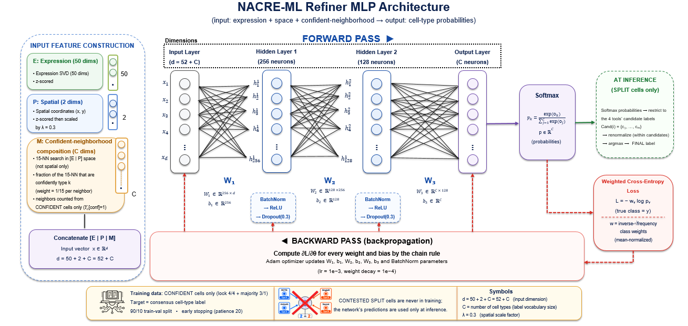

# NACRE-MLH pipeline

[](https://github.com/njabuloshong1/NACRE-MLH/pkgs/container/nacre-mlh)

Consensus cell-type annotation with a resolution certificate, for **Xenium**, **MERSCOPE** and
**CosMx**.

Four independent annotators (Seurat, Azimuth, RCTD, SingleR) label every cell. A learned resolver
settles the contested ones. The certificate then records, per cell, the deepest level at which the
annotators actually agree: **subtype**, **lineage**, **compartment**, or **unresolved**. Cells with
no agreement are reported as unresolved rather than given a label the data does not support.

---

## How the resolver works

The four annotators agree on most cells. Where they split, a small network decides, trained on the
cells they *did* agree on:



Each cell becomes a feature vector of three parts: its expression (50-component SVD, z-scored), its
spatial coordinates (scaled by λ = 0.3 so position informs without dominating), and the cell-type
composition of its 15 nearest neighbours counted over **confident cells only**. So `d = 50 + 2 + C`,
where `C` is the number of cell types in your reference.

Two properties bound what the resolver can do, and both are deliberate:

**It only ever trains on confident cells.** The 4/4 and 3/1 cells supply the labels; contested cells
are never in training and are exactly what the trained network predicts. The resolver generalises
the annotators' own agreement rather than forming an independent opinion.

**Its output is restricted to what the annotators proposed.** At inference the softmax is masked to
the candidate labels the four tools actually put forward for that cell, renormalised within those
candidates, then argmax. It cannot invent a cell type none of them suggested.

---

## Running it

### With Docker (nothing to install)

The image carries R, Python and every annotator dependency: Seurat, RCTD, SingleR, zellkonverter,
torch and the rest. Nothing is installed on your machine and no versions have to match.

```bash
docker pull ghcr.io/njabuloshong1/nacre-mlh:1.0.0

docker run --rm --gpus all -m 32g \
  -v /path/to/data:/data:ro \
  -v /path/to/results:/results \
  -v "$PWD":/work \
  ghcr.io/njabuloshong1/nacre-mlh:1.0.0 --config /work/runs.csv --out /results
```

Prefer a specific tag over `:latest` for anything whose results you intend to keep, so a rerun
months from now uses the same annotators.

To build it yourself instead of pulling (about 25 minutes, mostly compiling Seurat and spacexr):

```bash
docker build -t nacre-mlh .
```

Paths in your run sheet must be the paths **inside** the container (`/data/...`), not host paths.

**Set `-m` to the memory you are giving the run.** The chunk planner reads the container limit, so
without `-m` it sees all host memory and may over-commit. With it, chunking sizes itself correctly.

**`--gpus all` lets the resolver use a GPU.** The image ships a CUDA 12.4 build of torch; it needs
only the host driver and the NVIDIA Container Toolkit, not CUDA on the host. Without the flag the
same image still runs on CPU, and the startup report says which you got:

```
GPU     NVIDIA GeForce RTX 3050 (6.0 GB), CUDA 12.4
GPU     none visible (torch built for CUDA 12.4); the resolver will use the CPU. In Docker, pass --gpus all
```

Check that line. The commonest way to lose the GPU is forgetting the flag, not a missing driver.
Only the resolver uses it; the four annotators are R and run on CPU regardless, so they dominate
the runtime either way.

Or with compose, which has the mounts wired already:

```bash
NACRE_DATA=/path/to/data NACRE_RESULTS=/path/to/results \
  docker compose run --rm nacre --config /work/runs.csv --out /results
```

### Without Docker

```
python run_pipeline.py --config runs.csv
```

Results go to `./results` next to the script. Put them somewhere else with `--out`:

```
python run_pipeline.py --config runs.csv --out /path/to/results        # Linux, macOS
python run_pipeline.py --config runs.csv --out D:\work\results         # Windows
```

That is the whole thing. Everything below is optional.

First time:

```
python run_pipeline.py --init          # writes a template runs.csv
```

Edit `runs.csv`, then run the command above.

Dependencies are checked at startup and reported with versions. Nothing is installed for you; if
something is missing you are told which R or Python package and where.

---

## The run sheet

One row per dataset. CSV, TSV, or a plain text file, whichever you find easier to edit.

```csv
name,platform,query,reference,ref_label,truth,skip
MyBreast,X,data/xenium_run,refs/breast_ref.h5ad,celltype,,
MyOvary,C,data/cosmx_export,refs/ovarian_ref.h5ad,Cluster_Detailed,ori_celltype,
MyLung,M,data/merscope_run,refs/lung_ref.h5ad,,,y
```

Paths may be relative to where you run the script, or absolute in whatever form your system uses
(`/home/you/data`, `D:\data`, `D:/data` — forward slashes work on Windows too).

or, if you prefer:

```
[MyBreast]
platform  = xenium
query     = data/xenium_run
reference = refs/breast_ref.h5ad
ref_label = celltype

[MyOvary]
platform  = cosmx
query     = data/cosmx_export
reference = refs/ovarian_ref.h5ad
```

| Column | Required | Meaning |
|---|---|---|
| `name` | yes | run name; becomes the output folder |
| `platform` | yes | `X`/`Xenium`, `M`/`MERSCOPE`, `C`/`CosMx` (case-insensitive) |
| `query` | yes | vendor output folder, or a single `.h5ad` |
| `reference` | yes | folder holding the reference `.h5ad`, or the `.h5ad` itself |
| `ref_label` | no | cell-type column in the reference |
| `truth` | no | ground-truth column name, in the query or inside `truth_file` |
| `truth_file` | no | CSV/TSV of ground-truth labels, if they are not in the query |
| `min_counts`, `min_umi` | no | override the per-platform floors |
| `skip` | no | `y` leaves the row out without deleting it |

Bad rows are rejected before any annotator starts, naming the row and the problem. A missing folder
is caught in the first second rather than an hour in.

---

## The API key

Needed only when a reference uses cell-type names the shipped hierarchy has not seen. Supply it any
of three ways, checked in this order:

1. `--llm-key sk-...`
2. environment variable `OPENAI_API_KEY`
3. a file `key.txt` next to `run_pipeline.py`

If no key is supplied and none is needed, the run proceeds normally.

---

## Input formats

You do not need to rearrange your data. The loader identifies files by their **contents**, not their
names, so the CosMx and MERSCOPE export variants all load without configuration: legacy exports,
AtoMx SIP exports, gzipped 6K panels, multi-slide folders, and files whose cell ID lives in an
unnamed index column. Control probes (`NegPrb*`, `Negative*`, `SystemControl*`, `FalseCode*`) are
detected and removed.

If a folder cannot be read, the error says which file roles were found and which were missing.

---

## Outputs

Per run, in `<out>/<name>/`:

| File | Contents |
|---|---|
| `<name>_annotated.h5ad` | **your counts with every NACRE column attached** — open in scanpy and plot |
| `<name>_annotated.rds` | the same as a Seurat object, with `--rds` |
| `nacre_mlh_<name>.csv` | per-cell labels at all three levels, the four annotators' calls, concordance, certificate tier |
| `nacre_mlh_<name>_concordance.csv` | concordance before and after the resolver, per level |
| `figures/` | the figure set (below) |
| `query_<name>.h5ad`, `ref_<name>.h5ad`, `bases_<name>.csv` | intermediates, reused on rerun |
| `log_<name>.txt`, `pipeline_<name>.log` | the annotators' log and the pipeline's own |

Across runs, in `<out>/`:

`summary_datasets.csv`, `summary_concordance.csv`, `summary_certificate.csv`, `summary_votes.csv`,
`summary_accuracy.csv`, `SUMMARY.md`, and `NACRE-MLH_report.docx` with every table and figure.

### Figures

| Figure | Shows |
|---|---|
| `fig_certificate` | how far the certificate reaches, and where the annotators converge |
| `fig_concordance` | agreement before and after the resolver, at all three levels |
| `fig_spatial` | the section, coloured by label and by certificate tier |
| `fig_umap` | one panel per annotator plus NACRE at each level, shared embedding |
| `fig_markers` | marker dotplot per label at each level |
| `fig_depth` | transcript counts against certificate tier |
| `fig_accuracy` | only when `truth` was given |

Nothing about cell types is hardcoded. Labels, palettes and groupings are read off your data, so a
new tissue with a new reference vocabulary draws correctly without edits.

### The annotated object

`<name>_annotated.h5ad` is written every run; add `--rds` for a Seurat `.rds` as well. Both carry
the counts, the spatial coordinates, and all 18 NACRE columns, so nothing needs re-joining:

```python
import scanpy as sc
a = sc.read_h5ad("Xenium_OCCC_annotated.h5ad")
a.obs["usable_label"]          # the label at the depth the certificate allows
a.obs["nacre_resolution"]      # subtype / lineage / compartment / unresolved
```

```r
so <- readRDS("Xenium_OCCC_annotated.rds")
table(so$nacre_resolution)
DimPlot(so, reduction = "spatial", group.by = "predicted_lineage")
```

Columns keep their own names (`predicted_subtype`, `conc_lineage`, `usable_label`) except where the
name could collide with metadata you already have, which take a `nacre_` prefix (`nacre_resolution`,
`nacre_Seurat`, `nacre_RCTD`).

---

## Reading the certificate

The tiers are **mutually exclusive** and name the deepest level the certificate endorses:

| Tier | The annotators | You may say |
|---|---|---|
| `subtype` | agreed on the exact type | "this is a CD8+ T cell" |
| `lineage` | split on the type, agreed on the lineage | "this is a T cell" |
| `compartment` | split on the lineage, agreed on the compartment | "this is Lymphoid" |
| `unresolved` | split even on the compartment | nothing |

Certification cascades: a cell certified at subtype is necessarily certified at lineage and
compartment, because annotators agreeing on "CD8+ T cell" cannot disagree that it is a T cell.

Use `usable_label` when you want the label at the depth the certificate allows, and
`predicted_subtype` when you want the raw call regardless. **Unresolved does not mean the raw call is
worthless**, only that the evidence behind it is weak.

---

## Ground truth (entirely optional)

If you have reference labels for the query, the pipeline scores against them. If you don't, it says
so and reports everything else unchanged. **No ground truth is never an error.**

Three ways to supply it, tried in this order:

**1. A separate file.** Set `truth_file` to a CSV or TSV. The cell-id column is found by name
(`cell`, `cell_id`, `barcode`, …) or taken as the first column; the label column is the only other
one, or whichever you name in `truth`.

```csv
cell,cell_type
A9.4_1000_1,Cancer a
A9.4_1000_2,Macrophages
```

**2. A named column.** Set `truth` to a column in your query `.h5ad`.

**3. Nothing at all.** The pipeline looks through the query's `obs` for a plausible annotation
column, preferring names like `ori_celltype`, `cell_type`, `annotation`, `label`. It skips numeric
columns, its own bookkeeping, and anything resembling an annotator's output (`SingleR_annotation`
and friends), so it will not score itself against one of its own inputs. It prints the column it
chose and any others it considered:

```
ground truth: truth from: query_A94.h5ad [ori_celltype, 24 classes, auto-detected]
              (other candidates: sample_id)
```

Check that line. If it picked the wrong column, name the right one in `truth`.

The labels are read from your original file, since the rebuilt query keeps only its own QC columns
and your column would otherwise be lost. If only some cells match, the matched percentage is
reported alongside the accuracy.

Your labels are usually not the reference's labels, so subtype comparison is generally undefined:
`Cancer a` has no counterpart in `Epithelial Cells`. Both vocabularies are therefore collapsed
through the same hierarchy and compared at **lineage** and **compartment**.

Unfamiliar truth labels are placed into the hierarchy by one LLM call, printed as they are placed,
and cached to `hierarchy_truth_<name>.csv`. **That file is editable.** Ambiguous names are not always
placed the same way twice, and the placement feeds the accuracy, so check it if a label could go two
ways. Editing the file and rerunning with `--figures-only` rescores without touching the annotators.

Note that "accuracy" here means agreement with the labels you supplied, which are themselves an
annotation. Concordance is the evaluation that does not depend on trusting them.

---

## Useful flags

| Flag | Effect |
|---|---|
| `--only NameA,NameB` | process just these runs |
| `--fresh` | rebuild instead of resuming |
| `--figures-only` | redraw figures and summaries from finished runs |
| `--no-umap`, `--no-markers` | skip the two slow figures |
| `--rscript PATH` | if `Rscript.exe` is not on PATH |
| `--python PATH` | run the core with a specific interpreter |

Reruns resume: a run that already produced `nacre_mlh_<name>.csv` is skipped, and an interrupted
batch continues where it stopped. A failing run does not stop the others, and a failing figure does
not cost a run its tables.

---

## Requirements

Python: `anndata`, `scipy`, `scikit-learn`, `matplotlib`, `pandas`, `numpy`; optional `umap-learn`
(falls back to an SVD projection), `python-docx` (without it you still get CSVs and `SUMMARY.md`),
`openai` (only for hierarchy extension; pin `openai<2`).

R with `Seurat`, `spacexr` (RCTD), `SingleR`, `celldex`.

Checked at startup, with the missing piece named.

---

## Layout

```
run_pipeline.py        the only script you run
runs.csv               your run sheet
assets/hierarchy.csv   label -> lineage -> compartment
pipeline/              run sheet parsing, figures, summary
nacre_mlh_cp.py        core: query/reference build, orchestration
nacre/                 platform adapters, schema detection, consensus, resolver, certificate
annotators/            the four base annotators (R)
```

`nacre_mlh_cp.py`, `nacre/` and `annotators/` are an unmodified copy of the validated code. The
pipeline layer only drives them, so a change here cannot silently change an annotation result.

---

## Memory

You do not size anything. Before the annotators start, the pipeline reads free physical memory and
the panel width and works out how many cells fit in one pass:

```
memory: 300,000 cells x 5,001 genes needs ~134.1 GB but only ~15.3 GB is free;
        splitting into chunks of 16,402
```

A section that fits runs in a single pass, which is identical to not chunking at all. A section that
doesn't is split. If a chunk still dies, the chunk size halves and retries, down to 2,000 cells, so
a run does not fail for want of memory it could have worked around.

Override with `--chunk N` if you want to force it.

**One caveat worth knowing.** Only SingleR classifies each cell independently, so only SingleR is
unaffected by where chunk boundaries fall. Seurat and Azimuth find anchors against the query set,
and RCTD estimates platform effects across the puck, so splitting those changes results slightly.
That is exactly why chunks are sized as large as memory allows rather than being used by default,
and why the log always tells you when a run was split.

---

## Known limits

- Chunking a very large section slightly changes Seurat, Azimuth and RCTD results, as above.
- The certificate detects error caused by annotator **disagreement**. Error caused by the
  **reference** itself is invisible to it: if the reference has no granulocyte type, granulocytes
  will be confidently mislabelled by all four annotators and certified. Check that your reference
  vocabulary covers the populations you care about.
- Concordance is not correctness.
